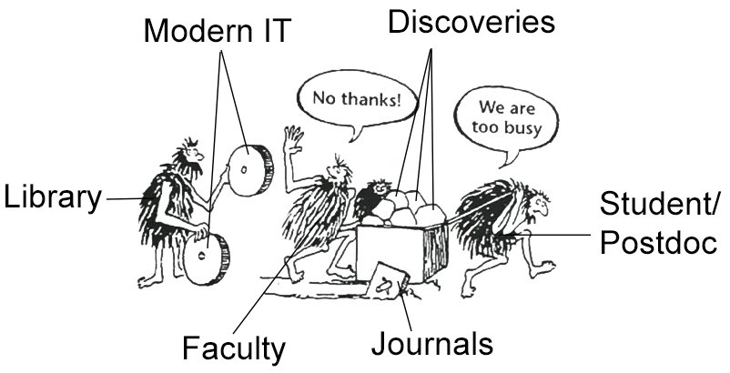
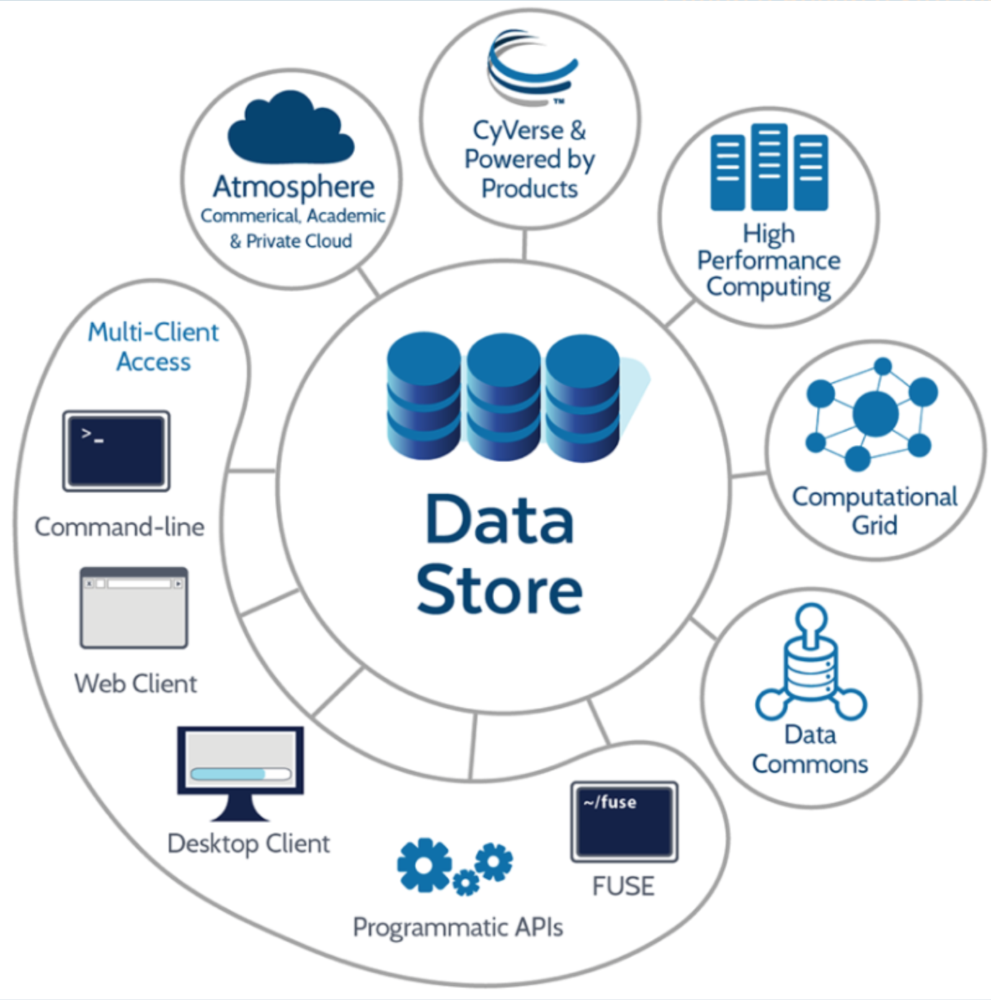
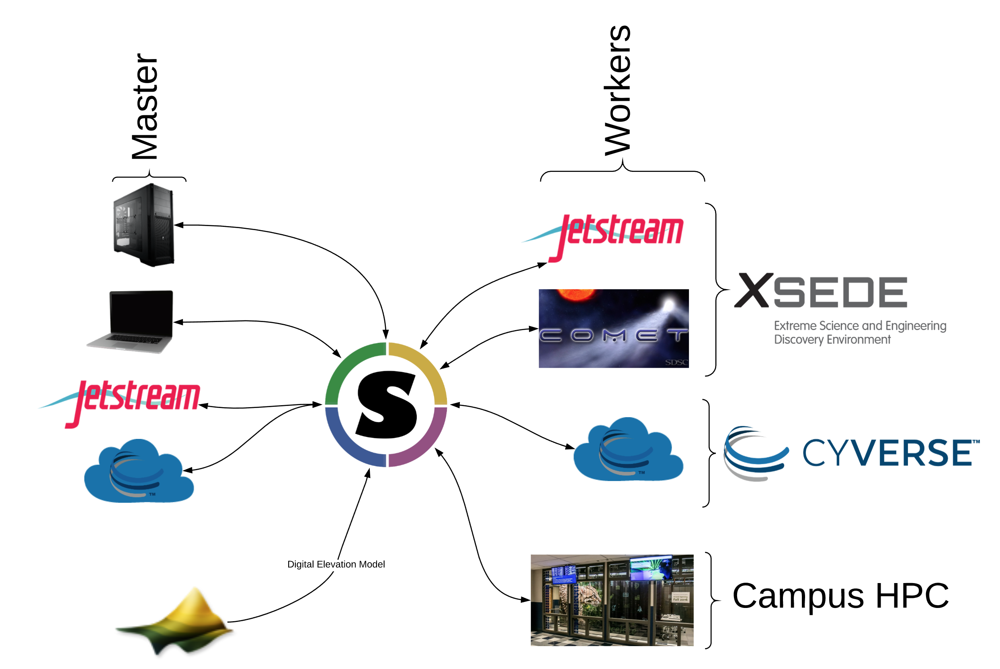
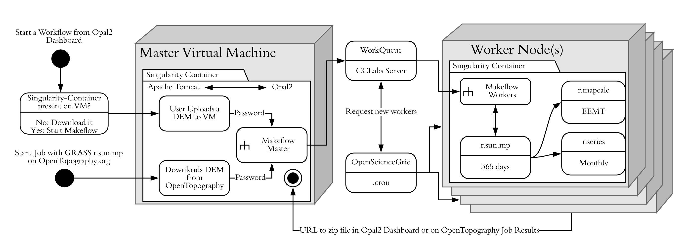

---

<span style="font: fsmall-caps bold 24px/1 sans-serif; font-size: 150%">Cyberinfrastructure for scientific reproducibility in data-intensive geospatial research and education</span>

###### January 29, 2018 
###### Tyson Lee Swetnam
###### CyVerse

---

### Contact

[http://www.cyverse.org/](http://www.cyverse.org/)

email: tswetnam@cyverse.org

github: tyson-swetnam

twitter: tswetnam

---

##### Problem #1: Adoption of new ideas.



Credit: http://bjoern.brembs.net/2018/01/why-academic-journals-need-to-go/ 
---

Cloud engines already offer compute on massive, long term, data archives


---

##### Problem #2: More data every day


Planet Labs: daily global coverage @3m; sub meter lidar and sfm at local scale from national repositories.


---

Wow! That's a lot of data and computing power! 

---

How do I utilize those platforms and data at scale?

---

### Option 1: Use a GIS data science workbench

---

Sounds great, what is a data science workbench?

---

 


---


---

 

---

### A Data Science Workbench allows you to:

- Send your algorithms to the data and compute <!-- .element: class="fragment" -->
- Work in your preferred environment, language, and libraries <!-- .element: class="fragment" -->
  - Python, R, C++, Matlab, Spark, etc. <!-- .element: class="fragment" -->

---

How do we make this all work together?

---


---


---

## Why Containerize?

- Dependencies can be wicked problems <!-- .element: class="fragment" -->
- Compiling software is slow <!-- .element: class="fragment" -->
- Reproducability is hard <!-- .element: class="fragment" -->

---

Don't have the money to buy time on private cloud?


---

## CyVerse [Atmosphere](https://cyverse.org/atmosphere)

+++

- Linux (Centos, Ubuntu)
- 1 CPU  to 16 CPU 
- 4 GB to 128GB RAM 
- Attach (swap) TB size storage volumes    
- emulated web shell and desktop 

---



---

Disclaimer: Being awesome with cloud and HPC doesn't just happen out of the box. 


---

@title[Docker + RStudio]

## <span style="color: #e49436">Docker + RStudio</span>
[http://learning.cyverse.org/](http://learning.cyverse.org/)
<br>

```shell
$ ezd
$ sudo docker pull rocker/geospatial
$ sudo docker run -d -p 8787:8787 rocker/geospatial

Done!

```

@[1](installs Docker with an Ansible Playbook)
@[2](pull the Rocker/Geospatial Rstudio-Server from DockerHub)
@[3](Run the Container in detached mode `-d` on port `-p 8787:8787`)
@[4](Open the Instance's IP address w/ port number in a new browser window)

---



---



---
